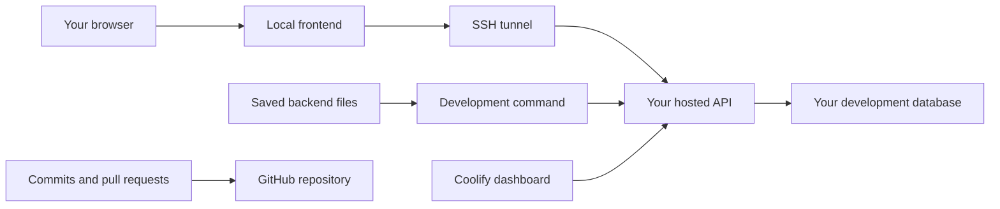

# Start coding on Arden

This guide takes a new teammate from installing tools to editing Arden, seeing changes, and opening a pull request. Use it for the **local frontend with hosted development backend** workflow.

**Setup status, 4 October 2026:** the hosted development services are registered in Coolify. Individual teammate accounts, protected slot assignments, scoped startup permissions, and the required workflow failure/authorization coverage still need an administrator handoff before broader onboarding. The development commands are currently in [PR #2](https://github.com/Arden-Enterprise/Arden/pull/2), not yet merged into `main`. You can prepare your computer now; start a hosted coding session after the maintainer confirms your access is ready.

This is an application scaffold. The sample graph UI and API health checks exist; Supabase Auth, Storage, Realtime, product features, and staging/production application releases are still to implement. The staging and production resources currently contain databases only.

## Contents

- [1. Understand where things run](#1-understand-where-things-run)
- [2. Get your private setup details](#2-get-your-private-setup-details)
- [3. Install the tools](#3-install-the-tools)
- [4. Download the right code](#4-download-the-right-code)
- [5. Set up SSH access](#5-set-up-ssh-access)
- [6. Create your private project settings](#6-create-your-private-project-settings)
- [7. Start your first coding session](#7-start-your-first-coding-session)
- [8. Know where to edit](#8-know-where-to-edit)
- [9. Use Coolify](#9-use-coolify)
- [10. Save work and open a pull request](#10-save-work-and-open-a-pull-request)
- [11. View a teammates work](#11-view-a-teammates-work)
- [12. Fix common setup problems](#12-fix-common-setup-problems)
- [Ready-to-code checklist](#ready-to-code-checklist)
- [macOS and Linux command differences](#macos-and-linux-command-differences)
- [Administrator handoff checklist](#administrator-handoff-checklist)

## 1. Understand where things run

| Name | Plain meaning | Where it runs |
| --- | --- | --- |
| Frontend | The screens you see and click | Your computer |
| API/backend | Server code that responds to the frontend | Your assigned development slot on the server |
| Database | Stored application data | Your slot's database on the server |
| SSH | An authenticated, encrypted connection to the server | Between your computer and the server |
| Coolify | The dashboard for managing server services and viewing their logs | On the server; open it in your browser |
| Git/GitHub | Local change history and shared code/review | Git on your computer; shared repository on GitHub |



There are four development slots. Each has its own API and database login; the four databases share one development PostgreSQL service. Staging and production have separate PostgreSQL services. Use synthetic development data.

Your Coolify display label follows `YOUR_NAME-local`. Despite the label, the API and database run on the server. The frontend runs on your computer. Coolify may display the label with spaces and capital letters.

Your internal slot ID is one of `dev-1`, `dev-2`, `dev-3`, or `dev-4`. Commands use that ID, **not** the display label. The administrator tells you which one is yours.

**Saving a file updates your development session. Committing records it locally. Pushing shares committed code on GitHub.** These are separate actions. A push does not currently deploy staging or production.

## 2. Get your private setup details

Send the maintainer this request through the team's approved private channel:

> I am setting up Arden using the teammate guide. Please confirm my development access is ready and send my assigned slot ID and Coolify label, approved source branch, SSH account/host/port, verified host fingerprint, and private remote project directory. Please invite my own accounts to GitHub and, if needed, Coolify. I will send my SSH public key after generating it.

Keep the reply private. This public guide intentionally has no working server address, account, password, key, or operational directory.

You need:

- Your own GitHub account with permission to push a topic branch or an approved fork workflow.
- Your own approved SSH account and public key registered by the administrator.
- Your assigned slot ID and its matching dashboard label.
- The real SSH hostname, port, and expected host fingerprint.
- The approved remote project directory, directly under `/srv`.
- An optional Coolify invitation and dashboard URL. Daily coding does not require Coolify administrator access.

**The administrator prepares server permissions.** You should not need to provision databases, edit sudoers, or install Docker on the server. A Coolify label alone does not grant SSH access. The [administrator checklist](#administrator-handoff-checklist) lists what must be ready.

## 3. Install the tools

The numbered walkthrough uses **Windows PowerShell on your computer**. Commands do not run inside Coolify or an SSH session unless a step explicitly says so. On macOS/Linux, use Terminal and the [command differences](#macos-and-linux-command-differences).

1. Install [Git for Windows](https://git-scm.com/install/windows). Enable using Git from the command line during installation.
2. Install **Node.js 24 LTS** from the [official Node.js download page](https://nodejs.org/en/download). Select the 24 release line and the installer for your computer. npm comes with Node.js.
3. Use a code editor you are comfortable with.
4. Open a **new, regular PowerShell window** after installing. Run each command separately:

```powershell
git --version
node --version
npm.cmd --version
ssh -V
```

Expected: Git and npm print versions, Node prints `v24.x.x`, and SSH prints an OpenSSH version. Exact patch versions can differ.

If `ssh` is missing, install **OpenSSH Client** through Windows Optional Features, then reopen PowerShell. See Microsoft's [OpenSSH installation instructions](https://learn.microsoft.com/en-us/windows-server/administration/openssh/openssh_install_firstuse). Only the client is needed on your development computer.

Install Arden's pinned package manager:

```powershell
npm.cmd install --global pnpm@11.19.0
pnpm.cmd --version
```

Expected: `11.19.0`. The repository's `package.json` is the source of truth if the team deliberately changes this pin later. Avoid installing an unpinned latest version. [pnpm installation and compatibility](https://pnpm.io/installation)

The `.cmd` suffix avoids PowerShell's script execution-policy errors. It is the same npm/pnpm tool. You do not need to change your execution policy.

Docker Desktop is needed for the separate, fully local database workflow. This hosted-backend walkthrough does not require Docker on your computer.

## 4. Download the right code

Choose a folder for your projects. This example uses your own Documents directory, regardless of your Windows username:

```powershell
New-Item -ItemType Directory -Force "$env:USERPROFILE\Documents\GitHub" | Out-Null
Set-Location "$env:USERPROFILE\Documents\GitHub"
```

**If an `Arden` folder already exists, do not overwrite it.** Use your existing checkout after checking `git status`, or choose a different empty clone destination and ask the maintainer which branch to use. Do not discard existing changes to follow this guide.

While PR #2 is open, the approved setup branch is:

```powershell
git clone --branch codex/feat/hosted-development https://github.com/Arden-Enterprise/Arden.git Arden
Set-Location Arden
```

**After PR #2 merges**, new teammates should instead clone `main`:

```powershell
git clone https://github.com/Arden-Enterprise/Arden.git Arden
Set-Location Arden
```

Run only the clone command for the maintainer-approved source. If the setup branch no longer exists, use `main` after confirming the PR merged.

Check the folder and install dependencies:

```powershell
git status --short
Test-Path package.json
pnpm.cmd install --frozen-lockfile
```

A fresh clone should have empty status output; `Test-Path` should print `True`; installation should finish successfully. `--frozen-lockfile` uses the dependency versions reviewed by the team. If it fails, keep the error and ask for help rather than deleting the lockfile.

Open this `Arden` folder in your editor. Read [CONTRIBUTING.md](../../CONTRIBUTING.md) and [AGENTS.md](../../AGENTS.md) before changing code.

Set your commit identity for this checkout. Replace both placeholders with your own values. For email privacy, copy your GitHub-provided `noreply` address from **GitHub Settings → Emails**:

```powershell
git config --local user.name "YOUR_CHOSEN_PUBLIC_NAME"
git config --local user.email "YOUR_GITHUB_NOREPLY_EMAIL"
```

These settings apply to this repository. The name and email become public commit metadata; they do not log you in to GitHub. [GitHub commit email guidance](https://docs.github.com/en/account-and-profile/how-tos/email-preferences/setting-your-commit-email-address)

Create a topic branch for your work. Replace the example with a specific task name:

```powershell
git switch -c feat/your-task-description
```

Until PR #2 is merged, this branch depends on it. Tell the maintainer about that dependency when opening your PR; merge the setup PR first. After it merges, new tasks should start from current `main` as described in [daily use](#10-save-work-and-open-a-pull-request).

## 5. Set up SSH access

SSH uses a pair of files: a **private key**, which stays on your computer, and a **public key**, which the administrator registers on your server account. Your key passphrase is entered directly in your terminal.

### 5a. Create or reuse your approved key

If you already have an approved key, keep it and use its path in the following steps. Otherwise:

```powershell
New-Item -ItemType Directory -Force "$env:USERPROFILE\.ssh" | Out-Null
Test-Path "$env:USERPROFILE\.ssh\project_server_key"
```

If this prints `True`, stop and reuse that key or agree on a different filename. If it prints `False`, generate a new key:

```powershell
ssh-keygen -t ed25519 -f "$env:USERPROFILE\.ssh\project_server_key" -C "project server access"
```

Choose a passphrase and enter it again when asked. Characters may not appear while you type; that is normal. Never accept an overwrite prompt for an existing key. [OpenSSH key generation](https://man.openbsd.org/ssh-keygen)

Show **only the public key**:

```powershell
Get-Content "$env:USERPROFILE\.ssh\project_server_key.pub"
```

Send that one public-key line privately to the administrator. Wait for confirmation that it has been installed on your own account. Do not send the file without `.pub`, a password, or a passphrase.

### 5b. Add a shortcut to your SSH configuration

Open:

```powershell
notepad "$env:USERPROFILE\.ssh\config"
```

Append this block without deleting existing entries. Replace the capitalized placeholders with your private handoff values:

```sshconfig
Host YOUR_SERVER_ALIAS
    HostName SERVER_HOST_FROM_ADMIN
    Port SERVER_PORT_FROM_ADMIN
    User YOUR_APPROVED_SERVER_USER
    IdentityFile ~/.ssh/project_server_key
    IdentitiesOnly yes
    ForwardAgent no
```

Choose a short alias using letters, digits, dots, underscores, or hyphens, starting with a letter or digit. It is a shortcut on **your computer**; it does not create DNS records. Keep the same alias for step 6.

Save the file as exactly **`config`**, not `config.txt`. In Notepad's Save As dialog, choose **All files**. Windows Explorer's file-extension display helps confirm the actual name. If you chose a different key filename, update `IdentityFile` too.

Check how SSH interprets the shortcut, keeping this output private:

```powershell
ssh -G YOUR_SERVER_ALIAS | Select-String '^(hostname|user|port|identityfile) '
```

It should show the administrator's real host, account, port, and your chosen key. If it still shows the alias as hostname and your Windows username as user, SSH did not read the expected configuration; fix that before continuing.

### 5c. Verify the server on your first connection

```powershell
ssh YOUR_SERVER_ALIAS
```

On the first connection, compare the displayed key fingerprint with the fingerprint supplied independently by the administrator. Enter `yes` only if they match. Enter your key passphrase locally if asked.

At the server prompt, run:

```sh
id -un
exit
```

The first command should show your approved server username. `exit` returns you to your own computer. If a server-account password is required or the fingerprint differs, ask the administrator to resolve key access or verify the server before proceeding. Keep host-key checking enabled.

### 5d. Load your key so the development command can connect

Windows can remember an unlocked key using its SSH authentication agent. Open **PowerShell as administrator on your own computer** just for these two commands:

```powershell
Set-Service -Name ssh-agent -StartupType Automatic
Start-Service ssh-agent
```

Close that administrator window. In your regular PowerShell window:

```powershell
ssh-add "$env:USERPROFILE\.ssh\project_server_key"
```

Enter your passphrase locally. If the machine is managed and you cannot enable the agent service, ask your computer administrator for help. [Microsoft's Windows key/agent guide](https://learn.microsoft.com/en-us/windows-server/administration/openssh/openssh_keymanagement)

Confirm unattended key login works:

```powershell
ssh -o BatchMode=yes -o StrictHostKeyChecking=yes -o ConnectTimeout=15 YOUR_SERVER_ALIAS 'id -un'
```

**Success:** your server username prints and you return to PowerShell without a password/passphrase question. The development commands use this noninteractive mode, so an interactive login alone is not enough. Recheck it after restarting your computer if the command later cannot authenticate.

For more SSH detail, including another operating system, see [server-access.md](server-access.md).

## 6. Create your private project settings

Run this from the checkout root, the folder containing `package.json`:

```powershell
New-Item -ItemType Directory -Force .private | Out-Null
if (-not (Test-Path .private/remote.json)) { Copy-Item deploy/hosted/remote.example.json .private/remote.json }
notepad .private/remote.json
```

The copy preserves an existing configuration. Replace the placeholders locally:

```json
{
  "sshAlias": "REPLACE_WITH_YOUR_APPROVED_ALIAS",
  "remoteRoot": "/srv/REPLACE_WITH_PROJECT_DIRECTORY",
  "defaultSlot": "dev-1",
  "localApiPort": 3001
}
```

| Setting | Enter this |
| --- | --- |
| `sshAlias` | The exact `Host` shortcut you created in step 5 |
| `remoteRoot` | The administrator's private project directory; it must be one folder directly under `/srv` |
| `defaultSlot` | **Your assigned** `dev-1`/`dev-2`/`dev-3`/`dev-4`; the example is not an assignment |
| `localApiPort` | Normally `3001`; a free local port if you already use that port |

Save as exactly `remote.json`. JSON requires double quotes, no comments, and no comma after the last property. The command reads this file automatically; do not put it in a tracked example.

Confirm Git excludes it:

```powershell
git check-ignore -v -- .private/remote.json
git ls-files --cached -- .private/remote.json
```

The first command should show an ignore rule. The second must print **nothing**. If either result is wrong, stop before publishing and follow [private-files.md](private-files.md). Each new clone needs its own private settings; GitHub deliberately does not contain them.

## 7. Start your first coding session

From the checkout root in regular PowerShell:

```powershell
pnpm.cmd remote:status
```

Example output shape:

```text
dev-N: available; source files: NUMBER
```

The real output uses your assigned slot number. `available` means no current writer lease; it does **not** prove the API/database is healthy or your writer permissions are ready. If it reports `writer connected`, close your other development session or ask the owner/operator before starting another one.

When the administrator has confirmed your access and slot are ready:

```powershell
pnpm.cmd dev:remote
```

The command:

1. Reserves your assigned slot for one writer.
2. Uploads the allowed backend source from this checkout, including saved changes not yet committed.
3. Starts/waits for the existing Coolify-managed development API and database. The first dependency install can take several minutes.
4. Opens an SSH tunnel available only on your computer.
5. Starts your local frontend after API/database readiness succeeds.
6. Watches saved backend changes while Vite watches your frontend.

Wait for **`backend ready`** and the frontend's **Local** URL. Open the exact URL printed, using port `5180` on your computer. Keep the terminal running. The sample Arden UI should appear.

To check the connection from your browser, append `/api/health/ready` to that Local URL; for example, `http://localhost:5180/api/health/ready` if Local uses `localhost`. Expected response: `{"status":"ok"}`. This checks the scaffold API's database connection, not all future product features.

### See your first change

Open `packages/ui/src/ArdenShell.tsx` in your editor. Find the sample node title `Release readiness`, change that text temporarily, and **save**. Your local page should update. Restore the original text and save once more unless that edit is part of your actual task.

### Stop at the end of a session

Press **Ctrl+C** in the development terminal and wait for the prompt to return. Your local frontend and tunnel stop; your writer reservation is released. The server API/database keep running and database data is preserved.

After a crash or lost connection, an unreleased reservation expires after **five minutes**. Restore connectivity and restart `pnpm.cmd dev:remote`; it reconciles the allowed backend files again. Do not delete another writer's reservation.

## 8. Know where to edit

| Path | What belongs here | What happens when you save |
| --- | --- | --- |
| `packages/ui/src/ArdenShell.tsx` | Current shared sample UI | Local frontend hot reload |
| `packages/ui/src/styles.css` | Shared UI styles | Local frontend hot reload |
| `apps/web/src/main.tsx` | Web entry point | Local frontend hot reload |
| `apps/api/src/` | Current API routes and server code | Allowed files upload; the hosted API restarts |
| `apps/desktop/` | Electron desktop shell | Separate local desktop workflow |
| `package.json`, workspace manifests, `pnpm-lock.yaml` | Dependencies and workspace configuration | Backend dependency changes can require reinstall/restart |
| `deploy/hosted/` | Reviewed server/container management code | Operator update; excluded from automatic source sync |

Backend scans happen roughly every 750 ms; network delay and restarts add time. A multi-file edit can briefly produce a compiler error until its other files arrive. Saving a file is required; unsaved editor text cannot sync.

Only selected backend paths sync. Large assets, hidden/ignored files, dependencies, build outputs, data, backups, and credential-like filenames are excluded. Current limits are **2 MiB per file** and **16 MiB total source**. A new backend package may need a reviewed allowlist update; see [remote-development.md](remote-development.md#daily-use).

SQL files can sync, but **database migrations do not run automatically**. Agree on a reviewed migration procedure with the environment/code owner. Use synthetic data and keep secrets out of ordinary source: filename exclusions cannot protect a hardcoded password.

For an intentional dependency change, update the manifests and lockfile together, stop your development command, and restart it with the corrected lockfile. Do not run `pnpm dev` alongside `dev:remote`; the fully local API can compete for the same port. Electron development is separate; `dev:remote` currently connects the web workflow only.

## 9. Use Coolify

Coolify shows server resources. Your local Vite frontend does not appear as a server resource. Daily source hot reload does not require clicking **Deploy** in Coolify.

### Find your API

1. Open the dashboard URL sent privately by the administrator.
2. Sign in with **your own invited account**. Select the team containing Arden if the dashboard offers a team switcher.
3. Open **Projects → Arden → development**.
4. Open the development Compose service. Its resource list contains the four developer API labels and the shared development PostgreSQL service.
5. Find your `YOUR_NAME-local` label. It may display as `Your Name Local`. The administrator's handoff maps this label to your internal `dev-N` slot ID.
6. Check its status. **Running (healthy)** means its configured health check is passing. If it is unhealthy, inspect your API logs or ask the operator.

Service titles/layout can change. If you cannot see the project, ask the administrator to check your team invitation and resource permissions. A missing invitation is not a reason to use another person's administrator login.

### Read logs

Inside the development service, open **Logs** or **Runtime Logs** and select your API container if asked. Look at recent entries around the time you saved or started the command. An API compile/dependency error can explain why your page cannot call the backend.

Keep logs private. Before sharing an excerpt, remove server endpoints, account names, connection strings, tokens, private paths, and application data. Send only the relevant sanitized error and timestamp through the approved channel. Do not paste entire logs or environment panels into public GitHub issues.

### Know which actions affect other people

| Action | Who should use it |
| --- | --- |
| View your API status and permitted logs | Contributor with appropriate access |
| Edit code and save | Contributor, in the local editor |
| Restart/redeploy the development stack or shared PostgreSQL | Operator coordinating affected developers |
| Change environment variables, mounts, domains, secrets, or resource limits | Operator through a reviewed change |
| Use a server terminal or database console | Only within explicitly approved access/task scope |
| Delete resources/volumes, restore backups, change staging/production | Authorized operator using a reviewed procedure |

The development database service is shared infrastructure. Stopping it affects all four slots. Full-stack deploy/restart can also interrupt teammates. Keep routine code changes in the development command and ask the operator about service operations. [Coolify Compose service documentation](https://coolify.io/docs/services/configuration/docker-compose)

Staging is intended for reviewed release validation and production for approved releases. Their database resources being healthy does not mean Arden applications are deployed there. The current `dev:remote` workflow cannot publish a release to either environment.

## 10. Save work and open a pull request

### Start the next day

1. Open your editor and terminal in the same Arden checkout.
2. Run `git status` and confirm the intended task branch. Continue unfinished work on that branch.
3. If dependencies changed when you updated code, run `pnpm.cmd install --frozen-lockfile`.
4. Confirm the SSH agent has your key loaded, then run `pnpm.cmd remote:status` and `pnpm.cmd dev:remote`.
5. Open the Local URL printed in the terminal and code normally.

**For a new task after the setup PR merges**, first stop the development command and finish/preserve your existing work. Only with a clean checkout:

```powershell
git switch main
git pull --ff-only
git switch -c feat/your-next-task
pnpm.cmd install --frozen-lockfile
pnpm.cmd dev:remote
```

Use a branch name matching the work, such as `fix/api-readiness-error` or `docs/setup-clarifications`. Stop the development command before switching branches; otherwise files from the branch switch can upload immediately. If Git reports local changes or conflicts, ask for help rather than resetting them.

### Commit one coherent unit of work

A commit records a finished, reviewable piece of the task. Include its related code and documentation together. Several coherent commits can belong to one PR.

Before committing a code change, follow the relevant verification in [CONTRIBUTING.md](../../CONTRIBUTING.md#verification), including focused behavior checks and the root typecheck/test/build commands. Documentation-only changes need link and consistency checks instead. Record only checks actually run.

Inspect filenames, then review the public diff locally:

```powershell
git status --short
git diff --name-only
```

If a private file appears in the tracked changes, stop before displaying/publishing its contents and follow [private-files.md](private-files.md). `.private/remote.json` and private SSH files must never enter the commit. Once the filenames are safe to inspect, run `git diff` locally to review the changes.

Stage **only the paths belonging to your task**. Example for a UI task; adjust the list to match your actual changes:

```powershell
git add -- packages/ui/src/ArdenShell.tsx packages/ui/src/styles.css
git diff --cached --name-only
```

Check that private and unrelated files are absent from the staged filenames. Then review and commit the intended changes:

```powershell
git diff --cached
git commit -m "feat(ui): improve graph navigation"
```

Use a descriptive Conventional Commit subject; do not commit a temporary setup-check text change accidentally.

### Push and request review

When the coherent task is ready for feedback, push one prepared batch:

```powershell
git push -u origin HEAD
```

If Git asks for GitHub sign-in, complete it through your own authentication tool/browser. Never paste a password/token into chat. If you lack push permission, ask the maintainer for repository access or the approved fork process.

On GitHub:

1. Open the [Arden repository](https://github.com/Arden-Enterprise/Arden).
2. Use **Compare & pull request**, or **Pull requests → New pull request** and select your task branch.
3. Normally use `main` as the base. For a branch depending on the unmerged setup work, agree on its base/merge order with the maintainer first.
4. Fill in the template: purpose, behavior, actual verification, limitations, and any migration/setup implications. Include sanitized screenshots for UI changes.
5. Create the PR and request a teammate review. Let the configured AI reviewers run; inspect their actual comments and coverage, including skipped or unavailable runs.
6. Evaluate feedback, commit related fixes together, and push one follow-up batch after an active review finishes.
7. Merge only after independent human review, required CI/checks, resolved required discussions, and maintainer authorization. A green AI badge alone is not approval.

Aim for one focused task per PR. Follow the repository's current review-size and reviewer-capacity rules in [AGENTS.md](../../AGENTS.md) and [CONTRIBUTING.md](../../CONTRIBUTING.md). Creating a PR, merging it, and deploying a release are separate milestones.

## 11. View a teammate's work

Ask the teammate for their Git branch and development slot ID. You need your own approved viewer access; choosing another slot does not grant writer rights.

Use a separate checkout if your current checkout has unfinished work. Install dependencies and create private settings in that checkout too. To view the teammate's **frontend**, check out their branch locally; preview does not download their UI or open the browser on their computer.

For a separate preview folder, substitute the teammate's published branch name and use a new, empty destination. Start in your projects directory, beside your normal `Arden` checkout:

```powershell
git clone --branch TEAMMATE_BRANCH https://github.com/Arden-Enterprise/Arden.git Arden-preview
Set-Location Arden-preview
```

Repeat step 6 for this checkout using **your own** alias and private settings. Keep your own assigned default slot; the preview option selects the approved teammate API. Then:

```powershell
pnpm.cmd install --frozen-lockfile
pnpm.cmd remote:preview --slot dev-2
```

Here `dev-2` is an example; substitute the teammate's approved slot. Their API must already be running and ready. Preview opens **your local frontend** against that API without uploading your backend or taking a writer reservation. It does not start a stopped API. Open the Local URL and press Ctrl+C when finished.

Close another local development/preview command first if it already uses ports `3001` or `5180`. Do not use `dev:remote --slot` to inspect someone else's slot: that command is a writer workflow.

## 12. Fix common setup problems

| What you see | What to do |
| --- | --- |
| `git`, `node`, npm, or pnpm is not recognized | Reopen the terminal after installation. Recheck step 3. If still missing, ask for help fixing the tool's PATH rather than changing the repository. |
| PowerShell says `pnpm.ps1`/`npm.ps1` cannot run | Use `pnpm.cmd`/`npm.cmd` as shown. |
| Missing `dev:remote` script, template, or API source | Confirm you are in the complete checkout root and on the approved setup branch. `main` does not contain this workflow until PR #2 merges. |
| Frozen-lockfile install fails | Confirm Node 24/pinned pnpm and the approved branch. Keep the lockfile; report the error. For an intentional dependency edit, update manifests and lockfile together. |
| `Could not resolve hostname YOUR_SERVER_ALIAS` | Check `%USERPROFILE%\.ssh\config`, especially `config.txt`, the `Host` alias, and the real `HostName`. Use the private `ssh -G` check in step 5. |
| SSH says permission denied or asks for a server password | Ask the administrator to confirm your account/public key. Check `IdentityFile`, run `ssh-add`, then repeat the unattended login check. |
| `ssh-add` cannot connect to the agent | On Windows, confirm the SSH agent service is running. Use `Get-Command ssh, ssh-add` locally to check both come from the same OpenSSH installation; Git's bundled SSH and Windows' agent can be different setups. Ask for help if they are mixed. |
| Host key verification fails or the fingerprint changed | Stop and verify with the administrator. Do not disable checking or blindly delete the known-host entry. |
| Missing/invalid `.private/remote.json` | Check the exact filename, valid JSON, alias, assigned `dev-N`, and administrator-provided root. Keep the contents private. |
| Upload/start is denied, or sudo requires a password | Ask the operator to check your protected slot assignment, source/state ownership, and scoped startup grant. Do not change accounts, use someone else's key, or grant yourself general sudo. |
| `writer connected`, lease busy, or writer conflict | Close your other writer session. After a crash, wait five minutes for expiry. Ask the operator if it remains occupied; do not take over another writer. |
| Backend did not become ready / startup failed | Repeat the unattended SSH check, check your local API port, and inspect permitted API logs or ask the operator. A missing managed container needs an operator deployment in Coolify. |
| Local API port `3001` is occupied | Stop your other owned development command or choose a free `localApiPort` in private settings, then restart. |
| Frontend port `5180` is occupied | Close your other owned Arden frontend/preview terminal. Ask for help finding an orphan process; do not kill every Node process. |
| UI change does not appear | Save the file, check the terminal for compile errors, and verify the browser URL/checkout. Shared UI is currently in `packages/ui`. |
| Backend change does not appear | Look for a `Synced ... backend file(s)` line, then API readiness/logs. Check the file is in the allowed backend paths; UI and deployment files have different behavior. |
| Source-size/allowlist error | Keep large assets/data/secrets outside synced source and ask the maintainer for an approved storage or package change. Do not bypass the allowlist. |
| SSH tunnel disconnected | Restore the network, wait for lease expiry if cleanup failed, and restart the development command. |
| Coolify project is missing | Check the invited team with the administrator. Local coding access and dashboard access are separate permissions. |
| Stage/production shows only PostgreSQL | Expected at this stage; release applications/deployment are not implemented yet. |

For help, send the step number, operating system, tool versions, command name with private values removed, and the relevant sanitized error. Do not send raw SSH/config dumps, `.private/remote.json`, private keys, full logs, screenshots of secret panels, or production data. Follow [private-files.md](private-files.md).

## Ready-to-code checklist

- [ ] Maintainer confirmed the approved source branch and my individual server access are ready.
- [ ] Node 24, pinned pnpm, Git, and SSH work in my local terminal.
- [ ] Dependencies installed with `--frozen-lockfile`.
- [ ] My own SSH key is registered; the fingerprint was independently verified.
- [ ] Unattended SSH prints my approved username without prompting.
- [ ] My private settings contain my assigned slot; Git ignores them and does not track them.
- [ ] My task branch is selected and another writer is not using my slot.
- [ ] `dev:remote` reaches backend readiness and prints the local frontend URL.
- [ ] I can see the sample UI and a saved local UI edit updates it.
- [ ] I know how to stop with Ctrl+C, commit a coherent change, and open a reviewed PR.

After one-time setup, the normal start command is:

```powershell
pnpm.cmd dev:remote
```

Quick reference:

| Goal | Windows PowerShell command |
| --- | --- |
| Check slot occupancy | `pnpm.cmd remote:status` |
| Code using your assigned slot | `pnpm.cmd dev:remote` |
| View an approved running teammate API | `pnpm.cmd remote:preview --slot dev-N` |
| Stop the local session | Ctrl+C in its terminal |
| Inspect local changes | `git status` |
| Share prepared commits | `git push -u origin HEAD` |

Replace `dev-N` with an approved real slot ID. Start the commands in the checkout root.

## macOS and Linux command differences

The same repository, private configuration, slot ownership, and daily workflow apply. Install Git and Node 24 for your OS using their [official Git](https://git-scm.com/install/) and [Node](https://nodejs.org/en/download) instructions. Use `npm` and `pnpm` without the Windows `.cmd` suffix:

```sh
npm install --global pnpm@11.19.0
git --version
node --version
pnpm --version
ssh -V
```

Clone the maintainer-approved branch into a new directory as in step 4. Enter that checkout and run `pnpm install --frozen-lockfile`.

For a new key, first check whether `~/.ssh/project_server_key` exists; preserve it if it does. Otherwise:

```sh
mkdir -p ~/.ssh
chmod 700 ~/.ssh
ssh-keygen -t ed25519 -f ~/.ssh/project_server_key -C "project server access"
cat ~/.ssh/project_server_key.pub
```

Send only that public line privately. Edit `~/.ssh/config` with your editor, preserving other entries, and use the same placeholder block from step 5. Then:

```sh
chmod 600 ~/.ssh/config
ssh YOUR_SERVER_ALIAS
```

Verify the fingerprint, check `id -un` on the server, then `exit`. Use your desktop/session SSH agent and run:

```sh
ssh-add ~/.ssh/project_server_key
```

If no agent is available in a Bash/Zsh session, start one for that session with `eval "$(ssh-agent -s)"`, then run `ssh-add` again. This agent environment may need reloading in a new session. [OpenSSH agent reference](https://man.openbsd.org/ssh-agent)

Repeat step 5's unattended SSH check. From the checkout root, create private settings without overwriting an existing file:

```sh
mkdir -p .private
chmod 700 .private
if [ ! -e .private/remote.json ]; then cp deploy/hosted/remote.example.json .private/remote.json; fi
chmod 600 .private/remote.json
```

Edit `.private/remote.json` locally. Perform the same Git exclusion checks in step 6, then:

```sh
pnpm remote:status
pnpm dev:remote
```

Follow the same readiness, editing, shutdown, and PR steps. Do not use `sudo pnpm` as a workaround for a local installation permission problem; use your OS-approved Node installation or ask your computer administrator.

## Administrator handoff checklist

**This section is for the environment/code owner and server operator. Teammates should receive a completed handoff before their first hosted session.** Use the [operator guide](remote-development.md#operator-setup-and-maintenance) for implementation details; this checklist does not grant new server privileges.

- [ ] Approve the source revision and integration order; PR #2 currently requires independent human review before merge.
- [ ] Prepare each contributor's distinct approved SSH account/key. Share the verified fingerprint and connection values privately.
- [ ] For the existing host, complete the protected account-assignment/source-state migration and deploy the reviewed helper/backend-image updates. **Do not rerun fresh provisioning on an existing project root.** Preserve source/state/configuration and a recovery route.
- [ ] Establish root-owned slot identities/control files, assigned source/state ownership, and only the permitted startup helper invocation for each contributor. Verify effective sudo restrictions and that another account cannot write/start the slot.
- [ ] Complete the required automated competing-writer, cross-slot denial, deletion reconciliation, disconnect cleanup, and failed-start coverage before broader onboarding. Cover managed-start marker/container/health failures as documented in the operator guide. Scaffold CI does not establish this coverage.
- [ ] Confirm managed development resources, private ports/mounts, and readiness; preserve database volumes. A dashboard label is not evidence of account isolation.
- [ ] Give the contributor their internal slot ID and matching `YOUR_NAME-local` label privately. Invite their own GitHub/Coolify accounts with the required scope.
- [ ] Supply the SSH hostname/port/account/fingerprint and approved private remote root through the approved private channel. Keep passwords/private keys and database credentials out of the packet.
- [ ] Confirm with the contributor that unattended login, private-file exclusions, their first coding session, and Ctrl+C cleanup work. Record actual results and unresolved limitations privately.

For deeper implementation and operations, use [remote-development.md](remote-development.md), [server-access.md](server-access.md), and [operations.md](operations.md). Keep this guide focused on getting a teammate into the daily workflow.
